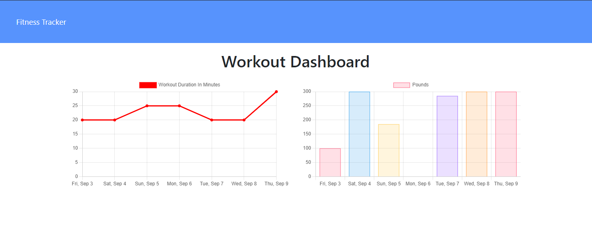

# Workout Tracker

🎵 Let's get physical, physical... 🎵

... in the gym, of course. Now's the time to burn off your lockdown lard and get that booty you've always dreamed of. 

But how will you know if you're improving?! By tracking your stats with this workout tracker. Check it out.

# How to use

Clone this repo and then run `npm install`. If you want to add some fake data to make yourself feel good run it's `npm run seed`. Start the app with `node server.js`.

# The app

# Deployment

The app is deployed [here](https://jack-workout-tracker.herokuapp.com/)
